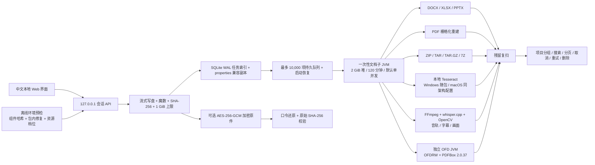

# 单机离线 Alpha 实现状态与生产差距

更新日期：2026-08-14

## 1. 当前定位

当前代码是“单机离线正式版优先”的 Alpha，不是已经完成生产验收的正式版。DOCX、XLSX、PPTX、文本型 PDF、压缩包、规则维护、人工复核、加密原件还原、持久队列和历史项目已形成闭环；Windows x64 包内置静态 Tesseract 5.5.2，图片与扫描件合成样例已完成端到端测试。音视频第一阶段已接入固定哈希的 LGPL-only FFmpeg、whisper.cpp 多语言 ASR 和 OpenCV CPU 小模型，并完成合成语音、画面文字、文本字幕及人脸/二维码/中国车牌样例回归；已增加相邻采样帧的保守轨迹桥接，但不是完整连续目标跟踪。精确 1 GiB PDF、近上限 1 GiB 高密度 DOCX/XLSX/PPTX 已完成生产链路处理，精确 1 GiB TAR 已完成上传与卷宗清单确认。真实 OCR/ASR/视频金标语料、复杂 Office/OFD、完整跨帧跟踪、1 GiB 媒体、企业多用户权限、10,000 文件实压和 macOS 双架构仍未完成。

判断链条如下：

1. 安全脱敏的目标是结果中不能恢复原值，单纯绘制可移除的黑框不成立。
2. OOXML 能在对象结构中替换并尽量保留编辑性，但内嵌位图必须 OCR，矢量图、SmartArt、OLE 等无法证明安全时应失败关闭或报警。
3. PDF/OFD 的高安全发布路径采用逐页栅格化重建，牺牲文本搜索、编辑、签章有效性，以换取不携带原文本层和活动内容。
4. 压缩包是容器，不是文档格式。必须逐项分类、默认排除未处理文件，并在结果清单中区分成功、失败、排除和用户确认的原样保留。
5. “可还原”依赖 AES-GCM 加密原件，不依赖逆向移除遮挡；忘记口令后无法恢复。
6. 规则和 OCR 都可能误报、漏报，因此必须保留人工复核、失败关闭、结果警告与残留复扫。
7. 音视频只能通过重新编码把静音和遮挡烧录进输出；播放器叠层不是脱敏。固定间隔抽帧会漏掉短暂画面，因此第一阶段必须明确采样降级并要求完整时间轴人工复核。

## 2. 已实现架构

- 主服务使用 Java 21，无云 API、无模型自动下载，只绑定回环地址。
- 文档、压缩包、人工复核和预览均进入一次性子 JVM；主服务默认一个并发解析任务，可显式配置为 1–2 个。
- OFD 再进入第二层独立类路径进程，避免主程序 PDFBox 3 与 OFDRW 所需 PDFBox 2 冲突。
- OFD 运行包显式排除 `com.itextpdf`，采用项目内 iText-free AWT 色彩兼容层；依赖锁、SBOM 和运行目录均已检查为零 iText。
- 媒体使用包内共享 FFmpeg/ffprobe、whisper.cpp CLI 和本地模型；运行时检测到 GPL/nonfree FFmpeg 配置或任一检测器缺失即拒绝媒体任务。
- 默认数据配额 20 GiB、最低空闲空间 2 GiB；上传、解析和解压均先申请容量预留。
- 结果先写临时文件再移动；完成、失败或取消后清理任务明文，等待复核/压缩包确认时除外。
- 历史页按不可变项目 UUID 分组，支持搜索、每页 100 项、项目级统计、任务级管理和项目级永久删除。

## 3. 格式与规则现状

| 范围 | 当前结论 | 主要边界 |
|---|---|---|
| DOCX | 基础合成测试通过 | SmartArt、自定义 XML、宏、修订及第三方嵌入对象仍需扩大语料 |
| XLSX | 基础合成测试通过 | 公式保留且只报警；超大工作簿仍可能耗用较多内存 |
| PPTX | 文本对象测试通过 | 图表缓存文字纳入事件流；位图缺 OCR 时失败关闭；OLE/ActiveX/VBA/签名失败关闭；矢量图仍需实样复核 |
| PDF | 文本型测试通过；扫描型条件支持 | 结果不可搜索/编辑；复杂嵌套图像、旋转和低清晰度需真实样本 |
| OFD | 合成 OFD 生成与预览测试通过；脱敏条件支持 | 必须安装中文 OCR；真实票据、签章和多阅读器兼容尚未验收 |
| PNG/JPG/JPEG/BMP | Windows 合成样例已验证 | Windows 包含 `chi_sim+eng` Tesseract；重新编码会清除普通元数据；真实语料待验收 |
| ZIP/TAR/TAR.GZ/7Z | 自动测试通过 | 最多 10,000 条目、单条目 1 GiB、总展开 8 GiB、ZIP 比率 200 倍 |
| RAR | 只识别反馈 | 不解压、不处理，要求用户转换格式 |
| MP3/WAV/M4A/FLAC | 第一阶段合成回归通过 | 全部音轨本地 ASR，规则命中区间静音；真实噪声、多人重叠、口音、4 小时上限和多编码器待验收 |
| MP4/MOV/MKV | 第一阶段合成/官方样例回归通过 | 文本字幕重写，未知/位图字幕移除；画面 OCR、人脸、二维码、中国车牌遮挡；已有相邻采样帧保守轨迹桥接，但无完整连续跟踪；多国车牌、快速闪现、30 分钟/1 GiB 压力待验收 |
| AVI/FLV/WMV | 不脱敏 | 仅识别或预览分类；压缩包内默认排除 |

规则引擎含 205 条内置中英文及国际规则，支持启停、黑名单、白名单、冲突优先级和项目级稳定化名。自定义规则工作台支持新增、编辑、复制、删除、保存前合成样例测试、JSON 导入导出及最多 20 个历史版本回滚；限制 100 条自定义规则，并拒绝空匹配、数字反向引用和典型嵌套无界量词，降低正则拒绝服务风险。覆盖中国、美国、加拿大、英国、欧洲与亚太多国身份、银行、车辆和房产字段；有公开校验算法的标识使用校验码，歧义较高的账号、车号和房产编号要求字段上下文，仍必须人工复核。

## 4. 批量卷宗与历史维护

- 浏览器多选文件使用同一项目 UUID，文件任务独立失败，不因单项错误静默中断整批。
- 压缩包先生成内部清单；危险文件和不安全路径永久排除，普通未支持文件只有二次确认后才能原样保留。
- 结果包包含 `_doc_redaction_manifest.json`，记录 `redacted`、`failed`、`excluded` 和 `included_unprocessed`。
- SQLite WAL 记录任务状态和状态迁移；重启后重新调度仍有原文的活动任务，缺失原文的任务标记为“已中断”。
- 支持取消、只对“已中断且原文仍在”的任务重试、单任务删除和整项目删除。
- 并发取消与状态持久化曾暴露锁顺序死锁，已改为先捕获任务快照、后进入存储锁，并加入确定性回归测试。

## 5. 可逆模式边界

- AES-256-GCM 保存完整加密原件；PBKDF2-HMAC-SHA-256 迭代 600,000 次，每个文件使用随机盐和随机 IV。
- 程序不保存用户口令；还原后重新计算 SHA-256，与上传原件一致才允许下载。
- 稳定化名使用本机主密钥和不可变项目 UUID 派生，同项目同原值保持一致，跨项目隔离。
- 本机主密钥仍是同一数据根中的文件级密钥，不是 Keychain、DPAPI、HSM 或企业 KMS。
- 未实现 RBAC、双人审批、密钥轮换、撤销、备份恢复和防篡改审计，因此企业多用户版后置。

## 6. 离线环境补全边界

- Windows 启动前验证 Windows 10+、x64、至少 4 GiB 内存、至少 4 GiB 可用磁盘、数据目录写权限，以及 Java/OCR/FFmpeg/FFprobe/whisper 和模型文件哈希。
- 软件组件缺失、被修改或出现额外文件时，从包内 SHA-256 校验过的修复归档重建 `app/runtime/ocr/media`；不联网下载、不写系统目录、不修改注册表或 PATH、不静默提权。
- 4–8 GiB、8–16 GiB、16 GiB 以上分别选择 constrained、balanced、standard 档位，自动调整主/子进程堆、并发、ASR 线程和视频抽帧上限。物理内存、磁盘和 CPU 架构不能由软件“补装”；低于硬门槛时必须阻断并生成 `data/diagnostics/environment-report.json`。
- Windows 已完成正常预检和“篡改组件后离线恢复且哈希一致”实测。macOS 13+ 脚本与打包逻辑已实现，但 Intel/Apple Silicon 均未实机执行，因此不能标记为通过。

## 7. 1 GiB 与 10,000 项的准确含义

已验证的是：上传通过 `.part` 临时文件事务式写入，精确 1 GiB 可接收并校验 SHA-256，超过 1 GiB 或截断流会失败并清理临时文件；精确 1 GiB PDF（128 页）在 75.704 秒内完成脱敏、残留复扫与 PDF 结构复核；精确 1 GiB TAR 在 6.880 秒内完成 5 项清单检查，4 项可脱敏、1 项默认排除，并停在二次确认。高密度 DOCX/XLSX/PPTX 已通过 256 MiB、512 MiB 与近上限 1 GiB 阶梯；Office 输出均通过全量事件流残留复扫及 ZIP/XML 结构复核。

尚未验证的是：1 GiB OFD/音视频、真实复杂业务内容的 1 GiB 文档、峰值内存/磁盘的系统级连续采样、长时取消，以及真实 10,000 文件卷宗的吞吐、恢复时间与用户操作。当前事实是“1 GiB PDF 与近上限高密度 Office 合成阶梯通过，TAR 边界清单通过”，不能表述为所有格式和所有对象均支持 1 GiB。

## 8. 后续优先级

1. 建立真实中文卷宗语料库，覆盖复杂 Office 对象、扫描 PDF、OFD 票据/签章和恶意格式变体。
2. 在已锁定 Tesseract 5.5.2、`chi_sim`/`eng` 来源和 SHA-256 的基础上，完成旋转、低清、表格和 CPU 基准。
3. 继续用现有 Office 包级事件流实现做真实复杂对象回归；另做 8 GiB 展开量和 10,000 文件压力测试，记录峰值内存、磁盘、吞吐、取消时间和崩溃恢复。
4. 为音视频建立真实中英文 ASR、压缩噪声、快速运动和多国车牌金标集；增加跨帧跟踪、签名/印章检测、1 GiB 压力和长时取消测试。
5. 在 macOS 13+ Intel/Apple Silicon 实机生成运行包，验证 NFC/NFD 中文路径、断网、签名和公证。
6. 增加离线 CVE 数据库、SAST、秘密扫描、恶意样本回归与发布签名。
7. 企业版再增加 RBAC、双人还原、KMS/OS 密钥库、防篡改审计、REST/消息接口和法律业务系统幂等集成。

## 9. 明确不成立的说法

- “画了黑框就是安全脱敏”：错误，原文本可能仍可复制或从对象流恢复。
- “支持 1 GiB 上传就是支持 1 GiB 处理”：错误，解析内存、临时磁盘和输出膨胀是独立问题。
- “规则命中率高就不需要复核”：错误，中文实体和 OCR 场景均存在不可消除的误报与漏报。
- “结果文件本身可以直接还原”：错误；当前从加密原件恢复原始字节。
- “压缩包完成就表示包内所有文件已脱敏”：错误；必须查看结果清单。
- “Windows 通过即可证明 macOS 支持”：错误；双架构、文件名规范化、签名和公证必须实机验证。
