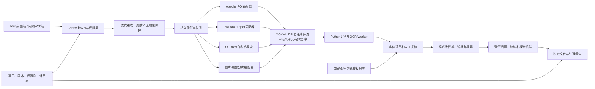

# MVP 技术架构基线

> 历史基线说明（2026-08-13）：本文保留早期目标架构，已不作为当前实现事实。现有 Alpha 已改为 Java 主服务 + 一次性文档子 JVM + 独立 OFD 子 JVM；OCR 使用本地 Tesseract CLI；音视频使用 FFmpeg、whisper.cpp 和 OpenCV CPU 小模型，不采用本文原定 Python/RapidOCR 运行时。实际完成情况以 `IMPLEMENTATION_STATUS.md` 和 `../audit/BUILD_AND_TEST_REPORT.md` 为准。

## 架构决策

以下是早期目标，不是当前运行结构：

- Java 21 文档主进程：任务调度、Office/PDF/OFD适配、文件重建、历史项目、还原密钥库和本地API。
- Python 3.12识别进程：Presidio规则编排、中文扩展识别和RapidOCR推理。

Python worker不开放固定HTTP端口。主进程使用标准输入输出、命名管道或随机一次性本地套接字通信，并校验进程身份和消息大小。

JPDFium暂不进入MVP。MVP的PDF高安全输出使用渲染后重建，避免仅覆盖黑框留下可恢复文本。

预览采用本项目自建本地层：Office 文档提供受限文本预览，PDF 按页渲染。kkFileView 的完整服务栈和 wps-view-vue 的 WPS 在线回调模式均不进入第一阶段依赖；完整 Office 版式验收交给用户本机办公软件。

## 模块关系

## 格式处理原则

### DOC/DOCX

- 遍历正文、表格、页眉页脚、文本框、脚注、批注、修订、超链接、嵌入对象和元数据。
- 优先原结构内替换，保持段落和文字运行样式。
- 对跨多个 run 的敏感词建立字符到对象位置映射，不能按单个 run 正则替换。
- 发布前删除修订历史、批注、作者、模板路径和自定义 XML 中的敏感残留。

### XLS/XLSX

- 大文件读取采用事件/SAX模式，写出采用分片或流式工作簿。
- 覆盖单元格、公式文本、公式缓存值、批注、隐藏表、隐藏行列、名称、外部链接和图表标签。
- 保留单元格类型和格式；对金额、身份证等支持格式保持伪值。

### PPT/PPTX

- 覆盖文本框、表格、SmartArt可访问文本、备注、母版、隐藏幻灯片、页眉页脚和嵌入文件。
- 对图片中的文字调用OCR，并把检测框映射回幻灯片坐标。

### PDF

- 文本型PDF先解析字符和坐标；扫描型或乱码字体进入OCR路径。
- 保真模式尝试对象级删除并保持搜索能力。
- 高安全模式在遮挡后渲染页面、重建PDF，并只写入经过脱敏的OCR文本层。
- 清理批注、表单、附件、JavaScript、动作、图层、元数据和旧增量对象。
- qpdf负责结构重写与校验，不承担敏感内容识别。

### OFD

- 使用OFDRW核心、包、读取、布局和Graphics2D模块，不使用converter/full。
- 对文本对象、图像对象、附件、元数据和签章对象分别检查。
- 修改签章覆盖内容后原数字签名必然失效，系统必须显式提示并记录；不能伪称保留签名有效性。

### 图片和视频

- 当前图片：OCR 坐标遮挡；视频第一阶段：FFmpeg 抽帧、OCR/YuNet/二维码/中国车牌检测、坐标遮挡和重新编码；已有相邻采样帧保守轨迹桥接，但尚无完整连续目标跟踪、签名或印章检测。
- 当前音频：whisper.cpp 多语言 ASR 后按规则命中时间段静音；尚无变声或敏感词替音。
- 多模态模型如后续接入也只做二次建议，最终遮挡必须由可复核时间、坐标和规则执行。

## 1GB处理模型

- 接收层以8至32MB分块写入磁盘并同步计算SHA-256。
- 原文件不进入SQLite或内存，不使用Base64传输。
- 每个任务使用独立工作目录，所有中间文件带项目和任务标识。
- 按页、工作表、幻灯片或视频时间片建立子任务和检查点。
- 单个解析进程崩溃不影响调度器；支持从最后成功检查点恢复。
- 默认拒绝展开倍率、文件数量或嵌套深度异常的压缩容器。
- 容量目标是处理正常、结构合法的1GB文件；恶意压缩包和畸形文件允许安全拒绝。

## 脱敏和还原

系统提供两个独立输出配置：

1. `internal_reversible`：同项目内确定性令牌替换，映射记录加密保存，只有授权角色可以还原。
2. `external_release`：删除或不可逆遮挡，不把映射包与结果文件一同导出。

每个项目生成独立数据加密密钥。密钥材料不得写入日志、数据库明文字段、命令行参数或配置仓库。原文件加密副本是字节级还原的唯一可信来源；PDF/OFD/图片/视频的黑块不能被当作可逆机制。

## API边界

- 桌面模式默认只监听 `127.0.0.1`，并使用随机端口和一次性会话令牌。
- 内网模式必须启用TLS、RBAC、审计、限流、1GB流式上传和幂等任务键。
- 处理API返回任务ID，不保持超长HTTP请求；完成后允许轮询或回调。
- 日志只记录实体类型、数量、位置摘要和哈希，不记录原始敏感值。

## 中文环境要求

- 源码、配置、JSON和日志统一UTF-8。
- Windows启动脚本显式设置UTF-8代码页；PowerShell读取文本时显式指定UTF-8。
- 覆盖中文用户名目录、中文长文件名、全角字符、繁简体、罕见姓名用字和Unicode规范化。
- macOS测试NFC/NFD等价文件名；Windows测试大小写不敏感和保留设备名。
- 不依赖用户机器已安装的宋体等商业字体；生产包仅包含许可证允许分发的字体。

## 下一开发门槛

下一阶段仍需要单独批准并执行：

- 为Windows和macOS分别生成并签名固定JDK 21运行时包。
- 建立Python 3.12隔离环境和本地wheelhouse。
- 下载并核验明确许可的中文OCR模型。
- 安装或构建固定版本qpdf二进制。
- 生成依赖解析后的SBOM、CVE报告和许可证归档。
